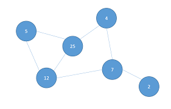

# Graph Terminology

## Basic Terminology

A **graph** is made up of **nodes** and **edges**. `n` will denote nodes and `m` will denote edges. In the graph above, the circles, or units of data (`5`, `25`, `12`, `4`, `7`, `2`). Edges are the paths from one node to another node. In the graph above, there are `6` nodes and `7` edges.

A **path** is a collection of edges that connects node `a` to node `b`. The **length of a path** is the number of edges the path contains. For example, the graph contains the path `5 -> 12 -> 7 -> 2` of length`3` from node `5` to node `2`.

A **cycle** is path in which the first and last node is the same. In the graph above, `5 -> 12 -> 25 -> 5` is a cycle. A **simple path** is a path in which each node appears _at most once_ in a path.

## Connectivity

A **connected** graph is a graph in which there is path between any two nodes. The graph shown **above** is connected.

The following graph is a **disconnected graph** because there is no path from `D -> E`, `A -> E`, etc.

Connected parts of a _disconnected_ graph is called a **component**. The graph above contains `3` components, `{A, B, C, D}`, `{E}`, and `{F, G}`.

A **tree** is a connected graph that consists of _`n`_ nodes and _`n - 1`_ edges. There is a unique path between any two nodes of a tree. Below is an example of a tree structure, it contains `13` nodes and `12` edges.

## Edge direction

The following graph is a **directed**. A directed graph is a graph in which edges can only be traversed in the direction of the arrows. The the above graph, `2 -> 3 -> 1 -> 4` is a path from node `2` to node `4`.

## Edge weight

The above grpah is known as a **weighted** graph. A weighted graph in which each edge is given a specific weight. The **length** of a path on a weighted graph is the sum of the weights of the edges on the path. For example, the length of the path `0 -> 1 -> 2 -> 3` would be `4 + 8 + 7 = 19`.

The **shortest** path from one node to another node is the path with the smallest length.

## Neighbors and degrees

Two nodes are **neighbors** if there is an edge between them. In the above graph, nodes `3` and `4` are neightbors. The degree of a node is the amount of neighbors the node has. For example, in the above graph, `1` has a degree of `3` because `2`, `0`, and `7` are neightbors of node `1`.

The sum of the degrees of every node in a graph is **always** `2m` where `m` is the number of edges. This is because each node will each edge increases the degree of `2` nodes by `1`

A **regular** graph is a graph such that each node has a degree of `d`. A **complete** graph is a graph in which each node has a degre of `n-1`. A complete graph is a graph in which every node is connected with every other node.

In a directed graph, the **indegree** of a node is the number of edges that end at that node, and the **outdegree** is the number of edges that start from that node. In the image of the directed graph in the Edge Weight section, the indegree of `1` would be two because there are two edges coming into one, from `3` and from `0`, and the outdetree of `1` would also be two because there are two edges extending from node `1`.

## Colorings

A **coloring** of a grph will assign each node with a color such that _no adjacent nodes have the same color_.

The graph above is known as a **bipartite** graph. A bipartite graph is a graph that can be **colored using two colors**. It turns out that a graph is bipartite if it does not contain a cycle with an _odd_ number of edges.

## Simplicity

A **simple** graph is a graph that

- Have no edges start and end at the same node
- Have no multiple edges between two nodes

Not simple graph

Simple graph

