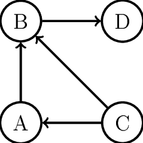

# Graph Representation
In this section, we are going to go over how to represent graphs using various data structures. The choice of data structure depends on the **size** of the graph and how the algorithm processes the graph.

## Adjacency list representation
In an adjacency list, each node `x` will have an **adjacency list** which consists of nodes to which there is an edge from `x`. We can create an adjacency list for each node by using an array of vectors.



In order to represent this graph, we will first establish that `A = 0`, `B = 1`, `C = 2`, and `D = 3`

```cpp
int n = 4; // n is the number of nodes
vector<int> adjList[n];
adjList[0].push_back(1);
adjList[1].push_back(3);
adjList[2].push_back(0);
adjList[2].push_back(1);
adjList[3];
```

In order to represent an undirected graph, we will store it using an adjacency list, but each edge is added in both directions. For example, if there is an edge between node `1` and node `2`, we would perform, 
```cpp
adjList[1].push_back(2); adjList[2].push_back(1);
```

For a weighted graph, we can extend our `vector<int> adjList[n]` into `vector<pair<int, int>> adjList[n]` where we store not only the node the edge is traveling to `(b)`, but also the weight of the edge `(w)`. This would look like,
```cpp
int n = 4;
vector<pair<int, int>> adjList[n];
adjList[0].push_back({1, 2});
```

Adjacency beneficial are useful when trying to find the adjacent nodes of a node because we can simple run a for loop as follows,
```cpp
for(auto i:adjList[1])
    cout << "There is a node to node " << i << "\n";
```

## Adjacency matrix
An adjacency matrix has a similar concept to the adjacency list in the respect that an adjacency matrix will also store which nodes are adjacent to a certain node. We will be representing the graph using a `2-D` matrix. `adj[a][b] = 1` if there is an edge **from a to b** and `adj[a][b] = 0` if there is **no edge from a to b**. Adjacency matricies can be extended to weighted graphs as well. To represent a weighted graph, we would *store the weight* of edge `a -> b` instead of whether an edge exists `(1)` or does not `(0)`.

The largest drawback of an adjacency matrix is that there are `n^2` elements within the matrix and most of them are `0`. Due to this reason, adjacency matrices can not be used for large graphs.

## Edge list representation
An **edge list** graph representation is a graph representation in which we store the edges of a graph within a `vector<pair<int, int>>`. Within this vector, pair `(a, b)` represents that there is an edge from `a -> b`. This can be extended to weighted graphs by initializing a `vector<int, int, int>` where `(a, b, w)` represents that there is an edge from `a -> b` with weight `w`.