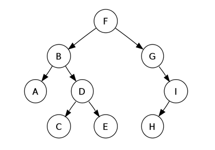

# Tree Algorithms

A **tree** is a special type of graph with the following attributes

- It is connected
- Consists of `n` nodes and `n-1` edges
- Removing any edge will divide the tree into two components
- Adding any edge will create a cycle
- There is always a unique path between any two nodes

The **leaves** of a tree are the nodes with a degree of `1`. In the above graph, the leafe nodes would be `A, C, E, & H`. The graph above is an example of a **rooted graph**, which is a graph where one node is appointed the *root* of the tree `(F)`, and all other nodes are placed underneath the root node. The **children** of a node is are it's *lower neighbors* and the **parents** of a node are it's *upper neightbors*. Keep in mind that every node in a tree has a parent, except the root node. Rooted trees are *recursive*. This means that **each node** acts as the root of a subtree which contains itself and all other nodes underneath it.