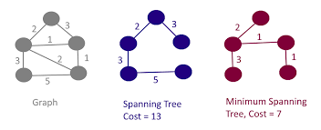

# Spanning Trees

A **Spanning Tree** of a graph is a graph that consists of _all_ nodes of the graph and _some_ edges of the graph. Spanning trees have edges such that*there is a path between any two nodes*. Like trees, they are acyclic and connected.

The **weight** of a spanning tree is the sum of the edge weights. Thus, a **minimum spanning tree** is a spanning tree of a graph with the _smallest weight_. Similarly, a **maximum spanning tree** is a spanning tree of a graph with the _greatest weight_.
