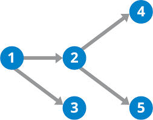

# Topological Sorting
Topological sorting is a way of sorting a **`DAG`**. In a topological sort, if there is a path from node `a` to node `b`, node `a` must appear before node `b`.

For example, in the above DAG, the Topological sorting would be `[1, 3, 2, 4, 5]`. Note that there are many different topological orderings for a given DAG.

The way we will find the Topological Ordering of a DAG is by going through all of the nodes of a graph and perform DFS at each unprocessed node. While we are performing DFS, our node can have `1` or `3` states,
- 0: Node has not been visited
- 1: Node is being processed
- 2: Node has been processed

We switch the state of a node to `1` if it has been visited and switch the state of the node to `2` once we have searched all of it's children. When we switch the state of a node to `2`, we will add it to our `topological_vector[N]`. Once we have searched all of the nodes, we will have our full `topological_vector[N]`, however, we will have to reverse our vector because the current `topological_vector` will return a reversed topological sort. We can reverse the vector with `reverse(topological_vector.begin(), topological_vector.end());`.
