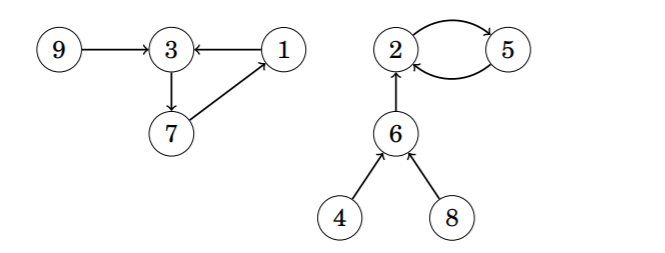

# Successors Path
A successor graph is a graph with the following characteristics
- Each node has an outdegree of `1`
- Each graph contains `1` or more components
- Each of these components **must contain a cycle**.

Successor Graphs are also known as **Functional Graphs** because a successor graph corresponds to a function that defines the edges of the graph. More specifically, `succ(x)` will always return `1` value by definition of a successor graph.

Since each node has `1` successor, we can also find `succ(x, k)` which is the ending node after "walking" `k` steps from node `x`. The most straightforward method of finding `succ(x, k)` would be by simulating each "step", however this would lead to a time complexity of `O(n)`, and `succ(x, k)` could be easily decreased to a complexity of `O(logk)` with preprocessing.

We can preprocess the successor graph and find `succ(x, k)` where `k` is a **power of `2`**. We can find all `succ(x, k)` in `O(nlogu)` time where `u` is the maximum number of steps possible, by using the recursive definitions, `succ(x, k) = {succ(x) if k == 1, succ(succ(x, k/2), k/2) if k > 1}`. After we preprocess all of these values, we can find `succ(x, k)` by representing it as a sum of powers of `2`. For example, in the above graph, `succ(x, 11) = succ(succ(succ(x, 8), 2), 1);`