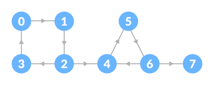
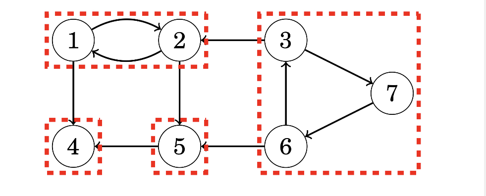

# Strong Connectivity

A directed graph that is **strongly connected** has a path from any node to all other nodes within the graph.

**Strongly connected componenets** are strongly connected componenets of a graph that are **as large as possible**.

Strongly connected componenets create an **acyclic component graph**.

