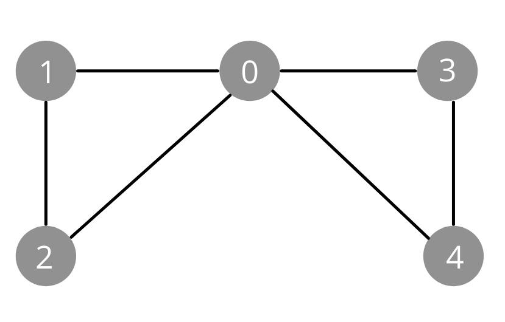

# Eulerian Paths
 A **Eulerian Path** is a path that goes through each *edge* exactly once.

 

In the above graph, there is a Eulerian path from node `4` to node `4` by the following path, `4 -> 3 -> 0 -> 1 -> 2 -> 0 -> 4`.

The above graph is also an **Eulerian Circuit** which is a Eulerian path with the same starting and ending node. Therefore, the path from node `4` to node `4` is an Eulerian path *and* an Eulerian circuit.

## Existance of paths and circuits
The existance of a Eulerian path or circuit depends on the **degree** of each node.

### Undirected Graphs
---

A Eulerian **path** exists when all edges belong to the *same connected component* and
* degrees of each node is *even*
* degree of exactly `2` nodes is **odd**, and the rest are **even**.

In the first case, **all** Eulerian paths are also Eulerian circuits. In the second case, the odd degree nodes are the start and end for an Eulerian path, but *not* an Eulerian circuit.

### Directed Graphs
---

A Eulerian **path** exists when all edges belong to the *same connected component* and
* indegree = outdegree for each node
* indegree = outdegree + `1` for `1` node, outdegree = indegree + `1` for `1` node, and indegree = outdegree for all other nodes

Similar to undirected graphs, all Eulerian paths are Eulerian circuits in the first case. In the second case, the two "special" nodes are the start and end for a Eulerian path, but not a Eulerian circuit.

## Hierholzers Algorithm
There is one algorithm for directed graphs and another algorithm for undirected graphs. In this summary, we will be looking at Hierholzer's for **directed graphs**. Hierholzers is an algorithm that is used to find a **Eularian circuit** which is a circuit in which we visit each edge exactly once. This algorithm is developed from this exact definition.

In Hierholzers algorithm, we are going to build an Eulerian Circuit based on `2` assumptions
* An Eulerian Circuit does exist
* The circuit starts at node `0`

The algorithm is fairly simple. Given our `adjList`, we can create a `map<int, int> edge_count` which is the number of edges a certain node has. Starting from `0`, we can traverse the graph by moving from one node to another. In order to make sure we don't traverse the same edge twice, the next node used will be `adjList[i].back()` and we can use `adjList[i].pop()` to remove that edge. In the case that a node has no other edges, we will add that node to our `vector<int> circuit` and use the previous node as our `curr_v`.

```cpp
void hierholzers() {
    unordered_map<int, int> edge_count;

    for (int i = 0; i < N; i++) {
        edge_count[i] = adjlist[i].size();
    }

    if(!adjlist.size())
        return;

    stack<int> curr_path;
    curr_path.push(0);
    int curr_v = 0;

    vector<int> circuit;

     while(!curr_path.empty()) {
        if(edge_count[curr_v]) {
            curr_path.push(curr_v);
            int next_v = adjlist[curr_v].back();
            edge_count[curr_v]--;
            adjlist[curr_v].pop_back();

            curr_v = next_v;
        } else {
            circuit.push_back(curr_v);
            curr_v = curr_path.top();
            curr_path.pop();
        }
    }

    for (int i = circuit.size(); i > 1; i--) {
        cout << circuit[i];
        if(i)
            cout << " -> ";
    }
}
```