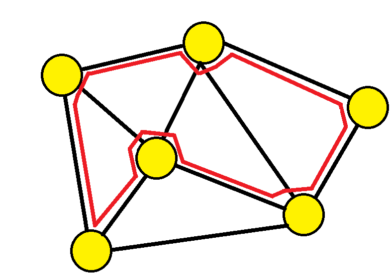

# Hamiltonian Paths
A **Hamiltoniona Path** is a path that visits **each node** exactly *once*.

The diagram above shows a picture of a hamiltonian path. Similar to the previous section, a **Hamiltonian Circuit** is a Hamiltonian path that begins and ends at the same node.

## Existance
There is no efficient way to determine whether a graph has Hamiltonion paths, however, there are a coupel theorems,
* If a graph is complete, there is a Hamiltonion path
* **Dirac's Theorem**: If the degree of each edge is at least `n/2`, the graph containns a Hamiltonion path
* **Ore's Theorem**: If the sum of degrees of each non-adjacent pair of nodes is at least `n`, the graph contains a Hamiltonian path

## Construction
There is no way to efficiently construct a Hamiltonion path or circuit. The only way would be to gennerate every single path possible on the graph which would take a massive `O(n!)` 