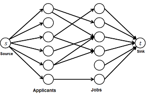

# Maximum Matchings

The **maximum matching** problem is asking us to find the maximum-size set of **node pairs** in an _undirected graph_ such that each pair has an edge between them and each node belong to at the most `1` pair. Normally, this problem would take polynomial time, but if the graph is **bipartite**, we can find the maximum matchings in a clever way.

## Find maximum matchings
To find the maximum matchings, we first need to split our undirected bipartite graph into left and right components. After we separate our graph into two parts, we will add two nodes, a source and a sink. There will be edges from the source to all of the left side nodes, and edges from all of the right sides nodes to the sink. The resulting will look similar to

After generating this graph, the number of maximum matchings will equal the **max flow** of the graph when the edge weights are `1`.

## Hall's Theorem
Hall's theorem states, if the number of left and right nodes are the same in an undirected bipartite, then it may be possible to construct a **perfect matching** which is where all nodes are in the maximum matching. Hall's theorem states that for any set `X` where only nodes from the left side are included, if `|X| <= |f(X)|`, we can construct a perfect matching. In this case, we define `f(X)` as the set of all nodes on the right side the nodes in `X` can reach.

## Konig's Theorem
A **minimum node cover** is the minimum set of nodes such that each edge has an endpoint within the set. Konig's Theorem states that the size of a minimum node cover equals the size of the maximum matching.

Now, the **maximum independent set** is defined as the maximum set of nodes such that none of nodes are connected with an edge. Essentially, all the nodes **not in** the minimum node cover. Thus, through Konig's theorem, we also know that the maximum indepent set is `n - MinNodeCover = n - maxFlowOfSpecialGraph`.