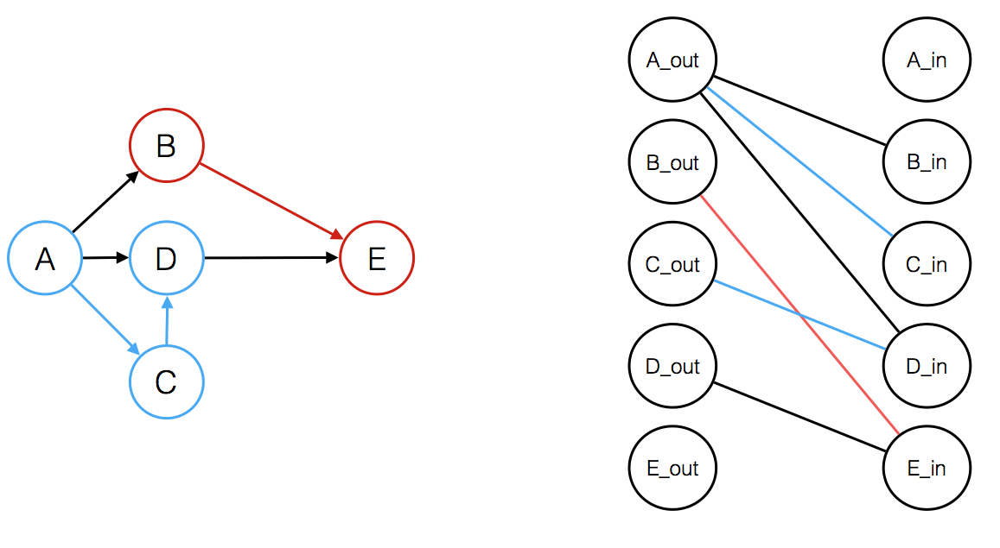

# Path Covers
A **path cover** is a set of paths in a graph such that each node of the graph is included at least one of the paths. Interestingly, in a directed, acyclic graph, we can find out the minimum path cover by finding the maximum flow of a modified graph.

## Node-disjoint path cover
In a **node-disjoint path cover**, every node only occurs in `1` and only `1` path. A path could contain no edges and could just be a singular node.

The special representation of this graph is known as a *matching graph*. In this graph, we will be representing each original node as two nodes, each with a left and right component. There will be an edge from the left node to the right node if there is an edge in the original graph. There will also be a source and a sink. The source will connect to every node and the right, and the sink will be connected to every node on the right. 

Using the max flow, we can calculate the maximum matchings in this new graph. After we calculate the maximum matchings, called `c`, the size of the minimum node-disjoint path cover is `n - c`.

## General path cover
The **general path cover** is a path cover except, a node **can be** in multiple paths. In this case, we will be using a graph similar to the above, but we will also add edges if there is a path from `a -> b`. Again, after calculating the maximum matchings, `c`, the size of the General Path Cover is `n - c`. 

## Dilworth's Theorem
An **antichain** is a set of nodes such that there is no path from any node to another using the edges of the graph. Dilworth's theorem states that the size of minimum general path cover **equals** the size of a maximum antichain.