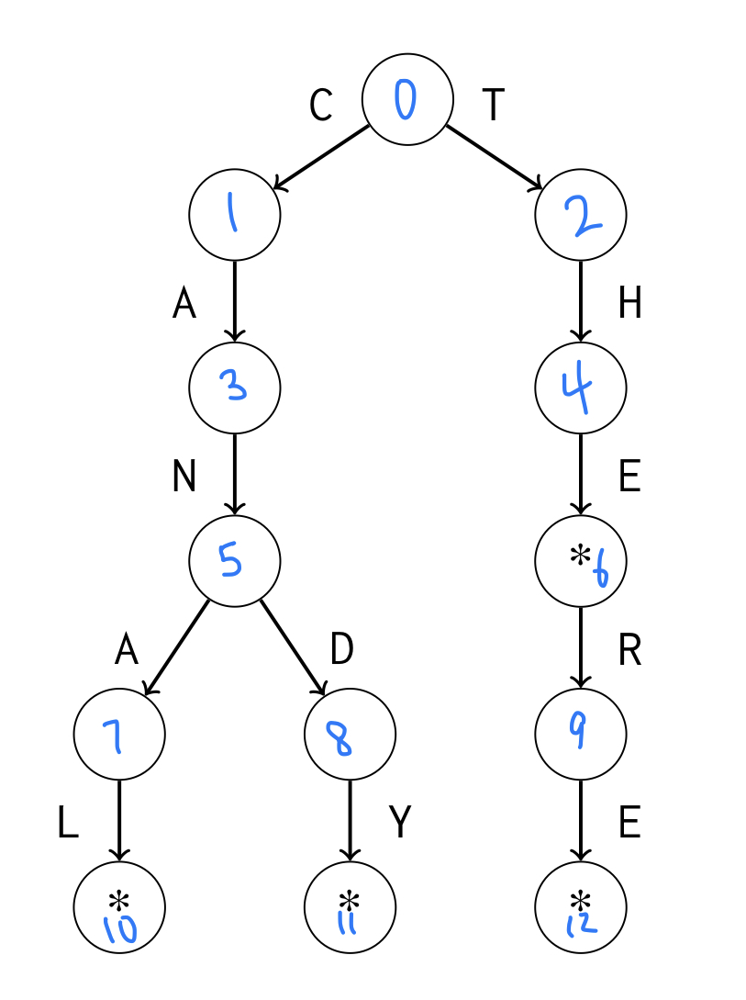

# Trie Structure
A **trie** is a rooted tree that maintains a set of strings. Each string is stored as a chain of characters that start from the root. If two strings share a common prefix, they also have a common chain in the tree. 

In the above graph, the `*` represents were a string ends. Therefore, in this trie, the strings in the set are `{the, there, canal, candy}`.

Using basic `DFS`, we can easily check whether the trie contains a string of length `n` or add a string of length `n` in `O(n)` time.

We will be storing a trie in an array `int trie[N][A]` where `N` is the number of nodes and `A` is the length of the given alphabet. Additionally, each node will be numbered `0, 1, 2, ..., N` where the root node is labeled `0`. `trie[s][c]` will return the next node in the chain when we move from node `s` using character `c`.